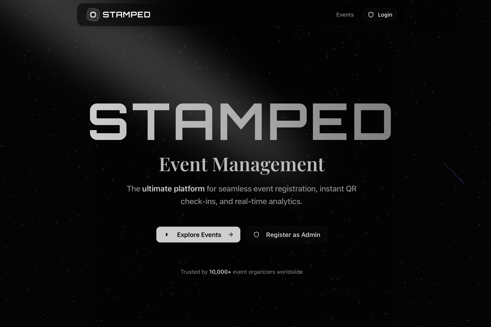
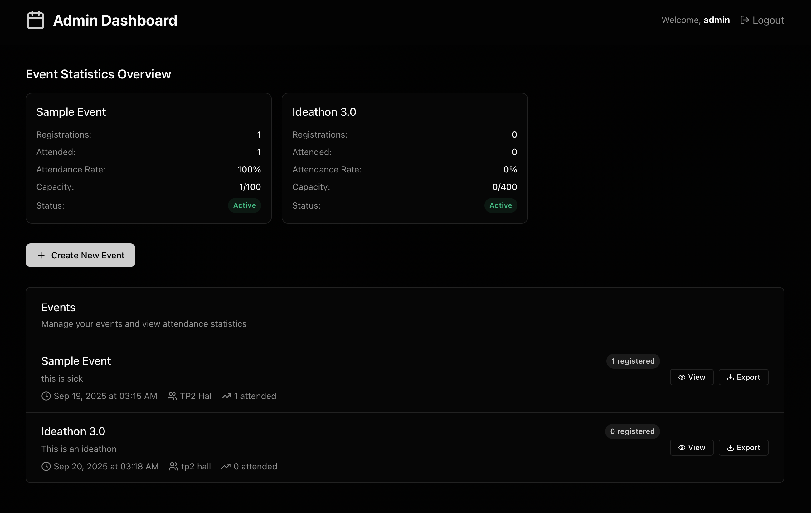

# 🎯 EventFlow Pro

<div align="center">



**A modern, full-stack event management system with QR code attendance tracking**

[](https://opensource.org/licenses/MIT)
[](https://nodejs.org/)
[](https://nextjs.org/)
[](https://mongodb.com/)

[🚀 Live Demo](#) • [📖 Documentation](docs/) • [🐛 Report Bug](#) • [💡 Request Feature](#)

</div>

---

## ✨ Features

### 🎪 **Event Management**
- **Create & Manage Events** - Full CRUD operations for events
- **Real-time Dashboard** - Live statistics and analytics
- **Event Categories** - Organize events by type and priority
- **Bulk Operations** - Import/export event data

### 📱 **QR Code Attendance**
- **Instant QR Generation** - Unique QR codes for each event
- **Mobile-First Scanner** - Optimized for mobile devices
- **Real-time Tracking** - Live attendance monitoring
- **Offline Support** - Works without internet connection

### 👥 **Participant Management**
- **Easy Registration** - Simple, user-friendly forms
- **Digital Tickets** - PDF ticket generation
- **Email Notifications** - Automated confirmations
- **Participant Analytics** - Detailed attendance reports

### 🔐 **Admin Dashboard**
- **Secure Authentication** - JWT-based authentication
- **Role-based Access** - Admin and user permissions
- **Real-time Analytics** - Live event statistics
- **Export Capabilities** - CSV/Excel data export

## 🛠️ Tech Stack

### **Backend**
- **Node.js** - Runtime environment
- **Express.js** - Web framework
- **MongoDB** - Database
- **JWT** - Authentication
- **QRCode** - QR generation
- **Multer** - File uploads

### **Frontend**
- **Next.js 15** - React framework
- **TypeScript** - Type safety
- **Tailwind CSS** - Styling
- **Framer Motion** - Animations
- **React Hot Toast** - Notifications
- **jsPDF** - PDF generation

## 🚀 Quick Start

### Prerequisites
- Node.js 18+ 
- MongoDB 6+
- npm or yarn

### Installation

1. **Clone the repository**
   ```bash
   git clone https://github.com/12asascoder/EVENT-MANAGEMENT-SYSTEM.git
   cd EVENT-MANAGEMENT-SYSTEM
   ```

2. **Install dependencies**
   ```bash
   # Backend
   cd backend && npm install
   
   # Frontend
   cd ../frontend && npm install
   ```

3. **Environment Setup**
   ```bash
   # Copy environment file
   cp env.example .env
   
   # Edit .env with your configuration
   MONGODB_URI=mongodb://localhost:27017/arnav-events
   JWT_SECRET=your-secret-key
   PORT=5001
   ```

4. **Start the application**
   ```bash
   # Terminal 1 - Backend
   cd backend && npm run dev
   
   # Terminal 2 - Frontend
   cd frontend && npm run dev
   ```

5. **Access the application**
   - **Frontend**: http://localhost:3000
   - **Backend API**: http://localhost:5001
   - **API Health**: http://localhost:5001/api/health

## 📱 Screenshots

<div align="center">

### 🏠 Landing Page


### 📊 Admin Dashboard


</div>

## 📚 Documentation

- [📖 API Documentation](docs/API.md)
- [🔧 Environment Setup](docs/ENV.md)
- [🏗️ Project Structure](docs/STRUCTURE.md)
- [⚡ Quick Reference](docs/QUICK_REFERENCE.md)
- [📝 Changelog](docs/CHANGELOG.md)

## 🏗️ Project Structure

```
EVENT-MANAGEMENT-SYSTEM/
├── 📁 backend/                 # Backend API server
│   ├── 📁 config/              # Database configuration
│   ├── 📁 middleware/          # Authentication & error handling
│   ├── 📁 models/              # MongoDB models
│   ├── 📁 routes/              # API routes
│   ├── 📁 utils/               # Utility functions
│   └── 📄 server.js           # Main server file
├── 📁 frontend/                # Next.js frontend application
│   ├── 📁 app/                 # Next.js app directory
│   ├── 📁 components/          # React components
│   ├── 📁 lib/                 # Utility libraries
│   └── 📁 public/              # Static assets
├── 📁 docs/                    # Documentation
├── 📁 assets/                  # Images and media
└── 📄 README.md               # This file
```

## 🔧 API Endpoints

### Authentication
- `POST /api/auth/register` - Register new admin
- `POST /api/auth/login` - Admin login
- `GET /api/auth/profile` - Get admin profile

### Events
- `GET /api/events` - Get all events
- `POST /api/events` - Create new event
- `GET /api/events/:id` - Get event by ID
- `PUT /api/events/:id` - Update event
- `DELETE /api/events/:id` - Delete event

### Participants
- `POST /api/registrations` - Register for event
- `GET /api/registrations/:eventId` - Get event participants
- `GET /api/registrations/:eventId/export` - Export participants

### Attendance
- `POST /api/attendance/mark` - Mark attendance
- `GET /api/attendance/:eventId` - Get attendance data

## 🤝 Contributing

We welcome contributions! Please see our [Contributing Guidelines](CONTRIBUTING.md) for details.

1. Fork the repository
2. Create your feature branch (`git checkout -b feature/AmazingFeature`)
3. Commit your changes (`git commit -m 'Add some AmazingFeature'`)
4. Push to the branch (`git push origin feature/AmazingFeature`)
5. Open a Pull Request

## 📄 License

This project is licensed under the MIT License - see the [LICENSE](LICENSE) file for details.

## 👨‍💻 Author

**Arnav Puggal**
- GitHub: [@arnavpuggal](https://github.com/arnavpuggal)
- LinkedIn: [Arnav Puggal](https://linkedin.com/in/arnavpuggal)
- Email: arnavpuggal@example.com

## 🙏 Acknowledgments

- [Next.js](https://nextjs.org/) - The React framework
- [Express.js](https://expressjs.com/) - Web framework for Node.js
- [MongoDB](https://mongodb.com/) - Database
- [Tailwind CSS](https://tailwindcss.com/) - CSS framework
- [Framer Motion](https://framer.com/motion/) - Animation library

---

<div align="center">

**Built with ❤️ by [Arnav Puggal](https://github.com/arnavpuggal)**

⭐ Star this repository if you found it helpful!

</div>